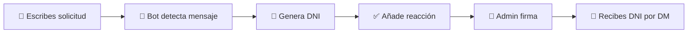

<div align="center">

# 📄 Sistema de DNI Automatizado

### *Bot de Discord para gestionar Documentos Nacionales de Identidad virtuales*

[](https://discord.com)
[](https://python.org)
[](LICENSE)

---

### ✨ Características Principales

🤖 **Automático** • 🎨 **Personalizable** • 💾 **Persistente** • ✅ **Firma Digital**

</div>

---

## 📖 Tabla de Contenidos

- [🎯 ¿Qué es este bot?](#-qué-es-este-bot)
- [🚀 Comenzar](#-comenzar)
- [👥 Para Usuarios](#-para-usuarios)
  - [Solicitar DNI Automático](#-solicitar-dni-automático)
  - [Ver Estadísticas](#-ver-estadísticas)
- [👑 Para Administradores](#-para-administradores)
  - [Crear DNI Manual](#-crear-dni-manual)
  - [Firmar DNI](#-firmar-dni)
  - [Configurar Canales](#-configurar-canales)
- [🎨 Personalización](#-personalización)
- [❓ Preguntas Frecuentes](#-preguntas-frecuentes)

---

## 🎯 ¿Qué es este bot?

Este bot automatiza completamente la creación, firma y gestión de **Documentos Nacionales de Identidad** virtuales para servidores de Discord de roleplay.

<div align="center">

### 🌟 Características Destacadas

| Característica | Descripción |
|:-------------:|-------------|
| 🤖 **Sistema Automático** | Los usuarios escriben un mensaje y el bot genera el DNI automáticamente |
| 🎨 **3 Países Disponibles** | España 🇪🇸, México 🇲🇽, Argentina 🇦🇷 |
| 🎭 **3 Temas de Diseño** | Clásico, Moderno, Oscuro |
| ✅ **Firma Digital** | Los administradores aprueban con botones interactivos |
| 💾 **Base de Datos** | Todos los DNIs se guardan permanentemente |
| 📱 **Código QR** | Cada DNI incluye un QR verificable |
| 📨 **Notificaciones DM** | El ciudadano recibe su DNI firmado por mensaje privado |

</div>

---

## 🚀 Comenzar

### Comandos Rápidos

```
/ayuda_dni      → Ver guía completa
/stats_dni      → Ver estadísticas del sistema
/crear_dni      → Crear DNI manual (solo admins)
```

---

## 👥 Para Usuarios

### 📝 Solicitar DNI Automático

El bot lee automáticamente mensajes en el canal de solicitudes. Solo copia y pega este formato:

<div align="center">

```
DNI nuevo
Edad: 18
Fecha de Nacimiento: 15/03/2006
Usuario de Roblox: TuUsuario123
País: españa
Tema: clasico
```

</div>

#### 📋 Campos Disponibles

| Campo | Descripción | Obligatorio | Valores |
|-------|-------------|:-----------:|---------|
| **Edad** | Tu edad | ✅ | 0-150 |
| **Fecha de Nacimiento** | Formato: dd/mm/yyyy | ✅ | Ej: 15/03/2006 |
| **Usuario de Roblox** | Tu nombre en Roblox | ✅ | Cualquier texto |
| **País** | País del DNI | ❌ | `españa`, `mexico`, `argentina` |
| **Tema** | Diseño del DNI | ❌ | `clasico`, `moderno`, `oscuro` |

> 💡 **Nota:** Los campos País y Tema son opcionales. Por defecto se usa España y tema Clásico.

---

### 🔄 Proceso de Solicitud

<div align="center">



</div>

1. **Escribes** tu solicitud en el canal configurado
2. **El bot detecta** automáticamente tu mensaje
3. **Se genera** el DNI con tus datos
4. **Añade ✅** a tu mensaje (procesado)
5. **Un admin firma** usando los botones
6. **Recibes** tu DNI firmado por mensaje privado

---

### 📊 Ver Estadísticas

Usa el comando `/stats_dni` para ver:

- 📄 **Total de DNIs** creados
- ✅ **DNIs firmados**
- ⏳ **DNIs pendientes** de firma
- 🌍 **Distribución por países**

---

## 👑 Para Administradores

### 🛠️ Crear DNI Manual

Si prefieres usar un formulario interactivo:

```
/crear_dni pais:España tema:Moderno
```

#### Pasos:

1. Ejecuta el comando
2. Selecciona **país** y **tema**
3. Se abre un **formulario**
4. Completa:
   - Edad
   - Fecha de Nacimiento
   - Usuario de Roblox
5. **Revisa el preview**
6. **Confirma** o cancela

---

### ✅ Firmar DNI

Cuando se genera un DNI pendiente, verás dos botones:

<div align="center">

| Botón | Acción |
|:-----:|--------|
| ✅ **Firmar y Aprobar** | Aprueba el DNI y lo publica |
| ❌ **Rechazar** | Rechaza la solicitud |

</div>

#### Al firmar, automáticamente:

- ✅ Se publica en el canal de DNIs firmados
- 📨 Se envía por DM al ciudadano
- 💾 Se guarda en la base de datos
- 🗑️ Se elimina el mensaje pendiente

---

### ⚙️ Configurar Canales

Configura dónde se leen solicitudes y dónde se publican DNIs firmados:

```
/config_canales canal_solicitudes:#solicitudes-dni canal_firmados:#dnis-oficiales
```

#### Ver configuración actual:

```
/config_canales
```

---

## 🎨 Personalización

### 🌍 Países Disponibles

<div align="center">

| Bandera | País | Código | Nacionalidad | Colores |
|:-------:|------|:------:|:------------:|---------|
| 🇪🇸 | **España** | `españa` | Español/a | Rojo y Amarillo |
| 🇲🇽 | **México** | `mexico` | Mexicano/a | Verde, Blanco y Rojo |
| 🇦🇷 | **Argentina** | `argentina` | Argentino/a | Celeste y Blanco |

</div>

---

### 🎭 Temas de Diseño

<div align="center">

| Tema | Estilo | Colores | Ideal para |
|:----:|--------|---------|------------|
| **Clásico** | Tradicional | Azul y blanco | Servidores formales |
| **Moderno** | Minimalista | Gris claro | Diseño contemporáneo |
| **Oscuro** | Dark Mode | Negro y gris | Usuarios dark mode |

</div>

---

### 📋 Información en el DNI

Cada DNI generado incluye:

<div align="center">

| Elemento | Descripción |
|----------|-------------|
| 👤 **Nombre** | Nombre de Discord del usuario |
| 🎂 **Edad** | Edad especificada |
| 📅 **Fecha de Nacimiento** | En formato dd/mm/yyyy |
| 💬 **Tag de Discord** | Mención del usuario |
| 🆔 **ID Único** | Formato: ESP-000001 (autoincremental) |
| 🎮 **Usuario Roblox** | Nombre en Roblox |
| 🌍 **País y Nacionalidad** | Según el país seleccionado |
| 📆 **Fecha de Ciudadanía** | Fecha de creación del DNI |
| ✓ **Estado** | Activo (siempre) |
| 📱 **Código QR** | Información verificable escaneada |
| 🔐 **Sello Oficial** | Verde (firmado) o Rojo (pendiente) |
| ✍️ **Firma** | Nombre del administrador que firmó |

</div>

---

## ❓ Preguntas Frecuentes

<details>
<summary><b>¿Puedo crear mi propio DNI?</b></summary>

No directamente. Solo los administradores pueden crear DNIs manualmente con `/crear_dni`. Sin embargo, **puedes solicitar uno** usando el sistema automático escribiendo un mensaje con el formato especificado en el canal de solicitudes.

</details>

<details>
<summary><b>¿Los DNIs se pierden si el bot se reinicia?</b></summary>

**No**. Todos los DNIs se guardan en una base de datos JSON (`dnis_database.json`) que persiste entre reinicios del bot.

</details>

<details>
<summary><b>¿Puedo cambiar mi DNI después de creado?</b></summary>

Actualmente no hay sistema de edición. Contacta a un administrador para que cree uno nuevo con los datos correctos.

</details>

<details>
<summary><b>¿Por qué no recibí mi DNI por mensaje privado?</b></summary>

Verifica que tengas activada la opción **"Permitir mensajes directos de miembros del servidor"** en la configuración de Privacidad de Discord para ese servidor.

</details>

<details>
<summary><b>¿Puedo tener DNIs de varios países?</b></summary>

**Sí**. Puedes solicitar un DNI por cada país disponible (España, México, Argentina).

</details>

<details>
<summary><b>¿Los códigos QR funcionan?</b></summary>

**Sí**. Cada código QR contiene la información del DNI en texto plano y puede ser escaneado con cualquier lector de QR.

</details>

<details>
<summary><b>¿Cómo sé si mi solicitud fue procesada?</b></summary>

El bot añadirá automáticamente una reacción ✅ a tu mensaje de solicitud cuando la procese.

</details>

<details>
<summary><b>¿Cuánto tarda en firmarse un DNI?</b></summary>

Depende de la disponibilidad de los administradores. Una vez que un admin presione el botón de firma, el proceso es instantáneo.

</details>

<details>
<summary><b>¿Qué pasa si escribo mal el formato?</b></summary>

El bot simplemente no procesará tu mensaje. Asegúrate de:
- Empezar con "DNI nuevo"
- Usar dos puntos `:` después de cada campo
- Seguir el formato exacto
</details>

---

## 💡 Ejemplos de Uso

### Ejemplo 1: Solicitud Básica (España)

```
DNI nuevo
Edad: 25
Fecha de Nacimiento: 10/05/1999
Usuario de Roblox: CarlosRP2024
```

### Ejemplo 2: Solicitud Completa (México, Tema Oscuro)

```
DNI nuevo
Edad: 19
Fecha de Nacimiento: 22/11/2005
Usuario de Roblox: MexicoPlayer99
País: mexico
Tema: oscuro
```

### Ejemplo 3: Argentina con Tema Moderno

```
DNI nuevo
Edad: 30
Fecha de Nacimiento: 03/07/1994
Usuario de Roblox: ArgentinaGamer
País: argentina
Tema: moderno
```

---

## 🎯 Comandos Completos

<div align="center">

| Comando | Quién puede usarlo | Descripción |
|---------|-------------------|-------------|
| `/ayuda_dni` | 👥 Todos | Muestra guía completa del sistema |
| `/stats_dni` | 👥 Todos | Ver estadísticas de DNIs |
| `/crear_dni` | 👑 Solo Admins | Crear DNI con formulario |
| `/config_canales` | 👑 Solo Admins | Configurar canales del sistema |

</div>

---

## 🔔 Notificaciones

### Para Usuarios:

- 📨 **DM al aprobar**: Recibes tu DNI firmado por mensaje privado
- ✅ **Reacción**: El bot marca tu solicitud con ✅

### Para Administradores:

- 🔔 **Mensaje en canal**: Aparece DNI pendiente con botones
- 📢 **Publicación automática**: DNIs firmados se publican en el canal configurado

---

## 📊 Sistema de IDs

Cada DNI tiene un **ID único** que nunca se repite:

- 🇪🇸 España: `ESP-000001`, `ESP-000002`, ...
- 🇲🇽 México: `MEX-000001`, `MEX-000002`, ...
- 🇦🇷 Argentina: `ARG-000001`, `ARG-000002`, ...

El número se **autoincrementa** con cada DNI creado.

---

## 🛡️ Seguridad

- 🔐 Solo administradores con el rol configurado pueden firmar DNIs
- 💾 Base de datos local segura
- 📱 Códigos QR verificables
- ✅ Sistema de aprobación obligatorio

---

<div align="center">

## 🎉 ¡Disfruta del Sistema de DNI!

Este bot fue diseñado para hacer la gestión de documentos virtuales **fácil**, **automática** y **profesional**.

---

**Versión:** 2.0  
**Desarrollado para:** Servidores de roleplay y comunidades  
**Soporte:** Contacta a los administradores del servidor

---

### 🌟 Si te gusta este bot, ¡dale una estrella en GitHub!

[](https://github.com/tuusuario/sistema-dni-bot)

</div>
